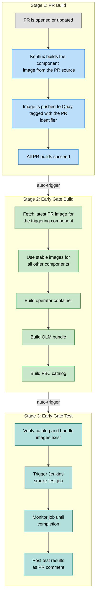
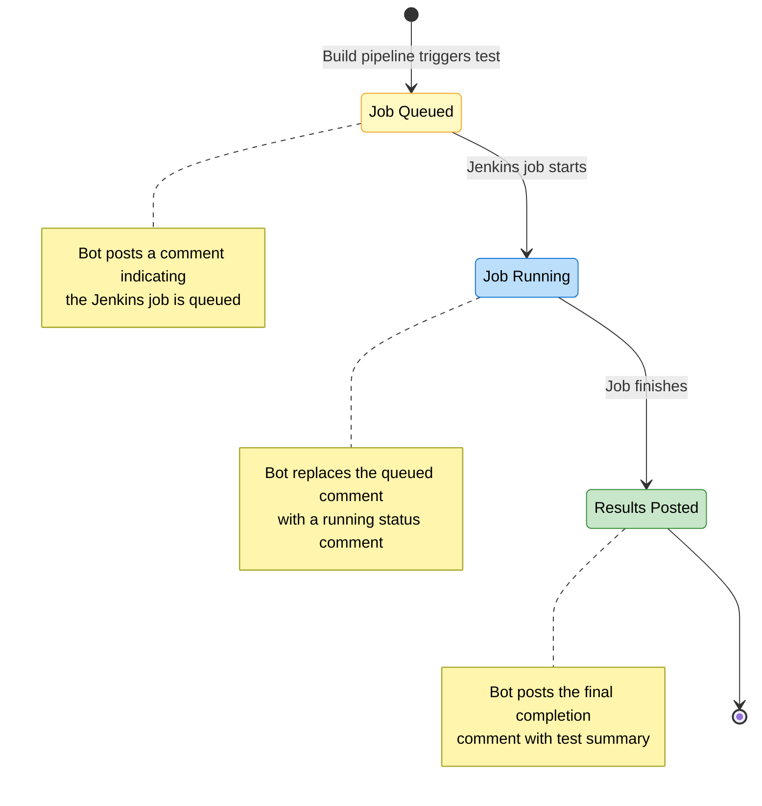

# Early Gate Testing — User Guide

Early gate testing is a pre-merge smoke testing infrastructure for ODH. It validates that a pull request does not break core functionality by building a complete set of OLM artifacts (operator, bundle, and FBC catalog) using the PR's latest images and running smoke tests against them — all before the PR is merged.

---

## 1. How It Works

When you open a pull request on an onboarded component or operator repository, the early gate infrastructure runs a three-stage pipeline chain:



**For component PRs** (e.g., feast, model-mesh, kserve): the build pipeline uses the PR's component image while keeping all other components at their latest stable versions.

**For operator PRs**: the build pipeline builds the operator directly from the PR's source code.

---

## 2. Triggering Early Gate Tests

### Automatic Triggers

Early gate pipelines are triggered automatically:

1. When all PR build pipelines succeed on a PR, the **early gate build pipeline** is triggered automatically.
2. When the early gate build pipeline completes successfully, the **early gate test pipeline** is triggered automatically.

No manual action is needed for the standard flow.

### Manual Triggers (PR Comments)

You can manually trigger each stage by commenting on the PR:

| Command | What It Does |
|---------|--------------|
| `/early-gate-build` | Triggers the early gate build pipeline (operator + bundle + FBC) |
| `/early-gate-test` | Triggers the early gate test pipeline (smoke tests) |

These commands are useful when:
- You want to re-run tests after a transient failure
- You want to trigger tests without waiting for all PR builds to complete
- A previous run was interrupted

---

## 3. What Each Stage Does

### Stage 1: PR Build

The standard Konflux pull request build pipeline. It compiles and builds a container image from the PR source code, pushes it to Quay with a PR-specific tag, and runs basic checks. This is the same build pipeline that runs for all PRs — nothing early-gate-specific happens here.

### Stage 2: Early Gate Build Pipeline

Builds a complete set of OLM artifacts using the PR's latest images:

1. **Operator image** — built from source (operator PRs) or fetched from the PR's existing image (component PRs)
2. **OLM Bundle** — operator bundle containing the CSV and CRDs, patched with the PR's component images
3. **FBC Catalog** — a File-Based Catalog fragment for the target OpenShift version

All three images are pushed to Quay and tagged with the PR identifier.

There are two variants of this pipeline:
- `early-gate-component-pipeline` — triggered by component PRs
- `early-gate-operator-pipeline` — triggered by operator PRs

Both follow the same structure; the difference is which repository triggers them.

### Stage 3: Early Gate Test Pipeline

Orchestrates smoke testing through Jenkins:

1. **Verify prerequisites** — confirms the catalog and bundle images exist on Quay
2. **Trigger Jenkins job** — dispatches a GitHub Actions workflow that starts a Jenkins smoke test
3. **Monitor to completion** — polls the Jenkins job status until it finishes
4. **Post results** — fetches the test summary and posts a completion comment on the PR

The test pipeline is **idempotent** — if it is interrupted and re-run, it detects the in-progress Jenkins job from the previous run and resumes monitoring it instead of triggering a duplicate.

---

## 4. PR Comments and Status Updates

The bot posts comments on your PR to keep you informed of the testing progress.

### During Testing

As the test progresses, the bot posts status comments showing the current phase (queued, running). These intermediate comments are automatically cleaned up once the next phase begins.

### Completion Comment

When testing finishes, a permanent completion comment is posted with the test results:

**All tests passed:**

> :white_check_mark: **Early Gate Test - Complete**
>
> | Field | Value |
> |-------|-------|
> | **Job URL** | /job/devops/job/early-gate-tests/42/ |
> | **Status** | :white_check_mark: SUCCESS |
> | **FBC Tag** | odh-pr-73-feast |
>
> **Test Summary**
>
> | Passed | Failed | Skipped | Total |
> |--------|--------|---------|-------|
> | 15 | 0 | 2 | 17 |

**Tests failed:**

> :x: **Early Gate Test - Complete**
>
> | Field | Value |
> |-------|-------|
> | **Job URL** | /job/devops/job/early-gate-tests/42/ |
> | **Status** | :x: FAILED - 3 test(s) failed |
>
> **Test Summary**
>
> | Passed | Failed | Skipped | Total |
> |--------|--------|---------|-------|
> | 12 | **3** | 2 | 17 |

### Comment Lifecycle



---

## 5. Re-running Tests

| Scenario | What to Do |
|----------|------------|
| Tests failed due to a real issue | Push a fix to the PR — the entire flow restarts automatically |
| Tests failed due to a transient/infra issue | Comment `/early-gate-test` to re-run just the test stage |
| Build failed or needs to be re-triggered | Comment `/early-gate-build` to re-run the build + test stages |
| Pipeline was interrupted mid-run | Simply re-trigger — the test pipeline detects the existing Jenkins job and resumes monitoring it |

Re-running is always safe. The test pipeline will not trigger duplicate Jenkins jobs.

---

## 6. Onboarding a Repository to Early Gate

To enable early gate testing on a new repository, use the **ODH Early Gate Onboarder** workflow in the `odh-konflux-central` repository.

### How to Onboard

1. Navigate to the [ODH Early Gate Onboarder workflow](https://github.com/opendatahub-io/odh-konflux-central/actions/workflows/odh-early-gate-onboarder.yml)
2. Click **Run workflow**
3. Fill in the required inputs:

| Input | Description | Example |
|-------|-------------|---------|
| **Repository name** | The component/operator repository to onboard (without `opendatahub-io/` prefix) | `kserve`, `model-mesh`, `feast` |
| **Target branch** | The branch in the component repo where early-gate should run | `main`, `v2.0`, `release-1.x` |

### What the Workflow Does

The onboarder workflow automates the complete setup:

1. **Copies pipeline files** to the component repository:
   - `.tekton/early-gate-ci-build.yaml` — early gate build pipeline
   - `.tekton/early-gate-ci-test.yaml` — early gate test pipeline
   - Creates a PR in the component repository with these files

2. **Updates the early-gate configuration**:
   - Adds the repository to `config/early-gate-config.yaml` in `odh-konflux-central`
   - Sets `early-gate-enabled: true`
   - Adds `additional-branches` if the target branch is not `main` or `master`
   - Creates a PR in `odh-konflux-central` with the config update

### Configuration Format

**For repositories using main/master branch:**
```yaml
repositories:
  my-component:
    early-gate-enabled: true
```

**For repositories using other branches:**
```yaml
repositories:
  my-component:
    early-gate-enabled: true
    additional-branches:
      - v2.0
```

### Re-running the Workflow

If you run the onboarder workflow for a repository that's already configured:
- The workflow detects the existing entry
- Shows the current configuration
- Exits without creating duplicate PRs

### Initial Onboarding Period

> **Note:** During the initial rollout phase (first few weeks), the DevOps team will handle repository onboarding to ensure proper setup and validate the automated workflow. If you need to onboard a new repository, please reach out to the DevOps team.

---

## 7. Limitations

- **ODH repos only** — early gate testing currently supports only ODH repository builds. RHDS and RHOAI builds are not supported yet.
- **Single architecture only** — early gate testing currently supports x86 architecture only.
- **Repo-scoped testing** — each early gate run tests a single PR from a single repository. Testing PRs from multiple repositories together (group testing) is planned for a future phase.
